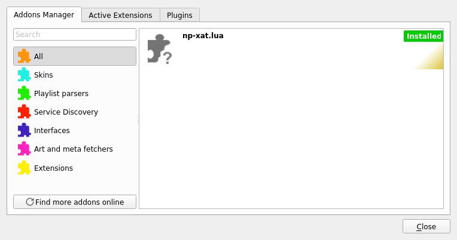
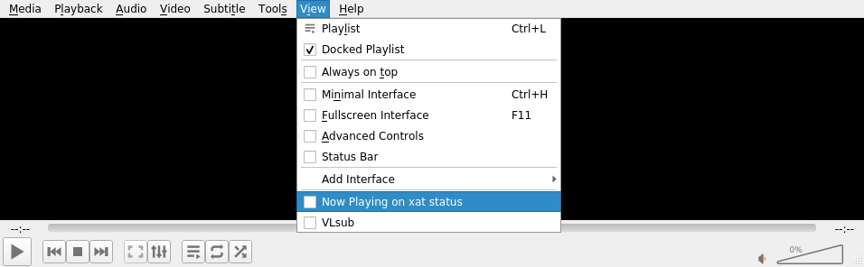
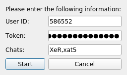

# vlc-np-xat
VLC's add-on to add a “Now Playing” status on xat.com

## How to install
There are two ways to install a VLC add-on: for every users on your computer, or
for your user only. The method presented here will install the plugin to a
single user.

- Windows: `%APPDATA%\vlc\lua\extensions\`
- Linux: `~/.local/share/vlc/lua/extensions/`
- Mac OS: `/Users/.../Library/Application Support/org.videolan.vlc/lua/extensions/`

It is very likely that the path does not exist. You will have to create it.

## How to run
Once installed, the plugin should be displayed within VLC's menu.

This can be found in the menu `Tools` > `Plugins and Extensions`  

In order to start the plugin, you need to enable it:

This can be found in the menu `View` > `Now Playing on xat status`  

When enabling the plugin, a new window will show up.  

You need to fill the 3 fields accordingly:
- User ID: your numerical user ID (e.g. 586552)
- Token: your secret API token. This is displayed at login
- Chats: a coma-separated list of chats. (e.g. Chat,xat5)

When everything is set up, press `Start` and listen to some music.

Your status should change to: `Title - Author (Album)`

## Troubleshooting
This software may have unintended side-effects (also known as “bugs”).

If this does not work, make sure you have days, the status power, and that the
chat you are currently connected at is added to your list of chats.

If this does not work, you're on your own: open VLC's debugging console
(`Tools` > `Messages` or with ctrl-M), set the verbosity to 2 (debug), and try
to make sense out of this mess.

Feel free to report problems, but keep in mind that the debugging console's
output **shows your API token**. Make sure you don't post it to everybody !
